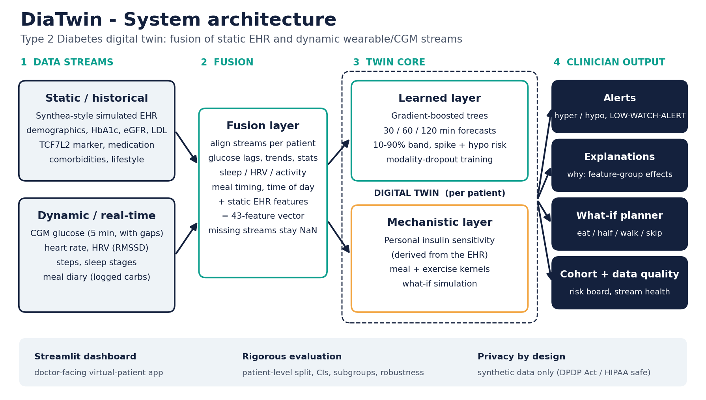
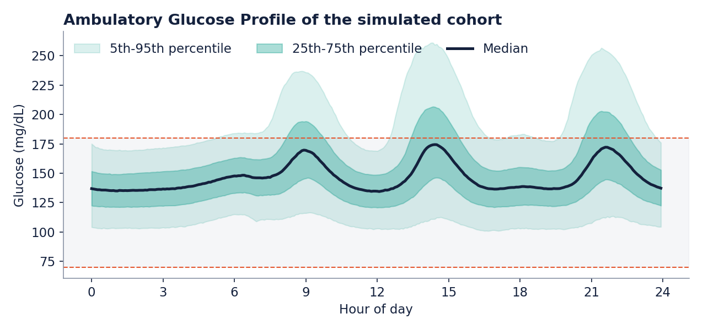
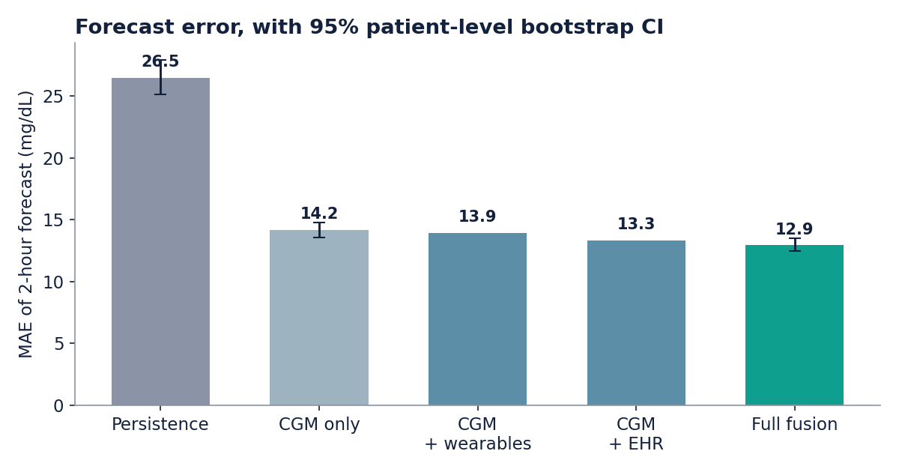
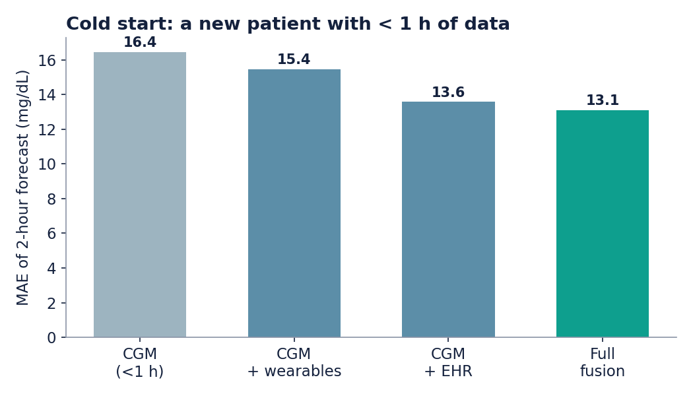
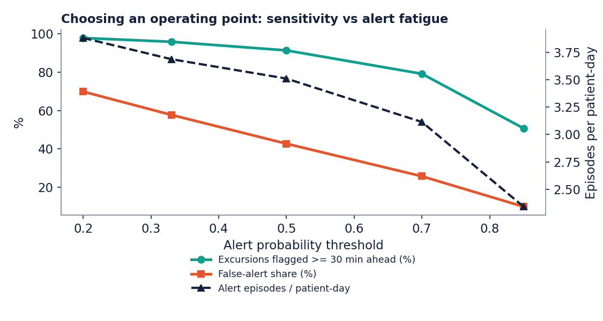
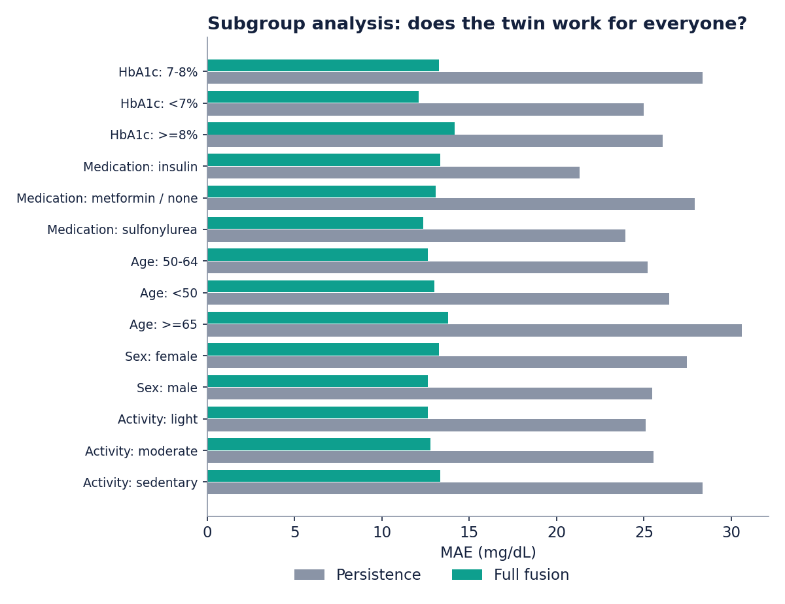
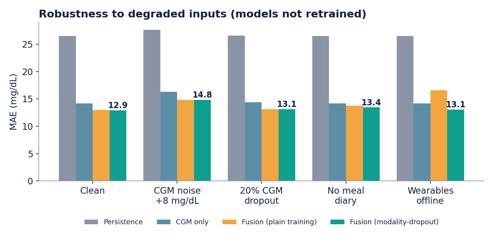
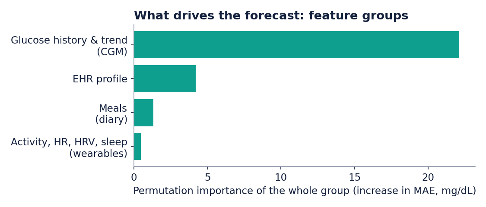
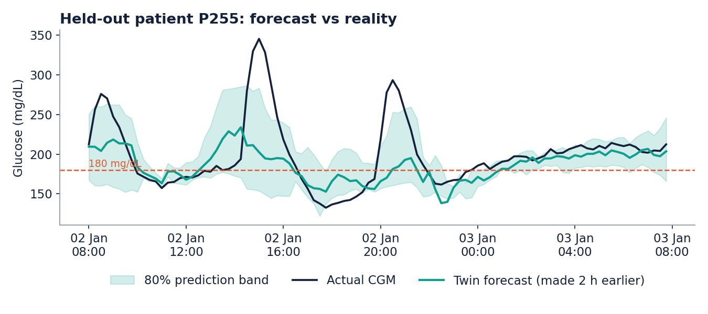
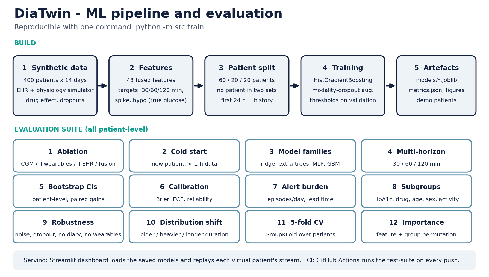

# DiaTwin: A Digital Twin for Type 2 Diabetes

> Forecast glucose **30, 60 and 120 minutes ahead**, alert **before** a spike or a low, **explain why**, and let the doctor **simulate what-if choices**, by fusing a patient's EHR with wearable and CGM data.

Submission for the **Digital Twin Challenge 2026** (Happiest Health, on Unstop), Phase 1: Prototype & Code Submission.



## Highlights

- **Two fused data streams** (challenge requirement): static EHR + dynamic CGM / wearables / meal diary, 400 synthetic patients x 14 days = 1,612,800 readings.
- **Forecast error 12.9 mg/dL at 2 h** (95% CI [12.4, 13.5]), **-51%** versus persistence; paired gain over CGM-only 1.22 mg/dL (CI [1.0, 1.4]), statistically significant.
- **Cold start:** for a newly onboarded patient the EHR cuts error by **20%** (16.4 to 13.1 mg/dL).
- **Spike-onset alert** ROC-AUC 0.929 (CI [0.923, 0.937]), well calibrated (ECE 0.009); **hypoglycaemia alert** ROC-AUC 0.970 on a rare event (CGM only 0.973).
- **Robust by design:** modality-dropout training keeps error at 13.1 mg/dL with wearables offline, where plain training degrades to 16.6.
- **Rigorous evaluation:** patient-level medication-stratified split, bootstrap CIs, 5 subgroup dimensions (HbA1c, medication, age, sex, activity), 4 robustness scenarios, a distribution-shift cohort, 5-fold CV, calibration, alert burden and lead time.
- **Explainable and honest:** per-patient "why" panel, operating-point trade-offs, and an explicit limitations section.

## Submission checklist (where each required item lives)

| Required item | Where |
|---|---|
| Team details | [1. Team details](#1-team-details) |
| College / incubator information | [1. Team details](#1-team-details) |
| Project title | [2. Project title](#2-project-title) |
| Problem statement | [3. Problem statement](#3-problem-statement) |
| Healthcare use case | [4. Healthcare use case](#4-healthcare-use-case) |
| Technical stack | [6. Technical stack](#6-technical-stack) |
| AI/ML model or framework details | [7. AI/ML model and framework details](#7-aiml-model-and-framework-details) |
| 15-20 minute demo video (unlisted YouTube) | [10. Demo video](#10-demo-video) |
| Open-source license details | [13. Open-source license](#13-open-source-license) (MIT, see [LICENSE](LICENSE)) |
| Architecture diagram (PDF/PPT) | [`docs/architecture_diagram.pdf`](docs/architecture_diagram.pdf) (2 pages) |
| Presentation (PDF/PPT) | [`docs/DiaTwin_Presentation.pptx`](docs/DiaTwin_Presentation.pptx) and [`.pdf`](docs/DiaTwin_Presentation.pdf) |
| Files and links publicly accessible | This repository is public; every file above is in it, no permissions needed |

Extra documentation: [Technical report](docs/TECHNICAL_REPORT.md) | [Model card](docs/MODEL_CARD.md) | [Data card](docs/DATA_CARD.md) | [Demo script](docs/DEMO_SCRIPT.md)

## 1. Team details

| | |
|---|---|
| **Team name** | DiaTwin |
| **Team leader** | Shivansh Porwal |
| **Team members** | Shivansh Porwal (individual participation; team size: 1) |
| **Role** | Team leader and sole developer |
| **College** | IMT Ghaziabad (Institute of Management Technology), PGDM program |
| **Incubator** | Not applicable |

## 2. Project title

**DiaTwin: A Digital Twin for Type 2 Diabetes Glucose Forecasting, Early Warning and What-If Simulation**

## 3. Problem statement

About **101 million Indians live with diabetes and 136 million more have prediabetes** (ICMR-INDIAB study, *The Lancet Diabetes & Endocrinology*, 2023). Care is largely **reactive**: clinicians see periodic lab values such as HbA1c and occasional glucose readings, but not what the next two hours hold for a given patient. Post-meal spikes, and lows in patients on insulin or sulfonylureas, go unseen until harm accumulates.

## 4. Healthcare use case

**Condition:** Type 2 Diabetes (chronic, lifestyle-linked, highly prevalent in India), as the challenge requires one specific condition.

**Adverse events predicted**
- **Hyperglycaemic excursion:** glucose crossing **180 mg/dL** within 2 hours (upper bound of time-in-range).
- **Hypoglycaemia:** glucose dropping below **70 mg/dL** within 2 hours.
- Plus continuous **30 / 60 / 120-minute glucose forecasts** with an 80% uncertainty band.

**How it is used**
1. A patient is onboarded with their EHR; the twin personalises itself from it (day one, before much sensor history exists).
2. Wearable, CGM and meal-diary data stream in; the twin updates continuously and **flags missing streams** instead of silently guessing.
3. The doctor's dashboard shows forecasts, hyper/hypo risk, a **"why this forecast"** explanation and a ranked **cohort board** of who needs attention.
4. The doctor or patient asks "what if I eat this, walk after, or skip it?" and sees the next three hours under each choice.

## 5. The two data streams (challenge requirement)

| Stream | Content | Source in this prototype |
|---|---|---|
| **Static / historical** | demographics, BMI, disease duration, HbA1c, fasting glucose, eGFR, LDL, hypertension, TCF7L2 genetic risk marker, medication, activity, diet | Synthetic EHR ([`src/synth_ehr.py`](src/synth_ehr.py)); Synthea importer ([`src/import_synthea.py`](src/import_synthea.py), unit-tested on mock Synthea-layout CSVs) |
| **Dynamic / real-time** | CGM glucose (5 min, with sensor dropouts), heart rate, HRV (RMSSD), steps, sleep stages, meal diary (85% logging rate) | Physiology-based simulator ([`src/simulate_sensors.py`](src/simulate_sensors.py)) |

How credible is the synthetic data? Glycaemic metrics of the simulated cohort against the international consensus on CGM targets:

| Metric | DiaTwin cohort | Consensus reference |
|---|---|---|
| Time in range 70-180 mg/dL | 86% | > 70% (target for most adults) |
| Time above 180 mg/dL | 14% | < 25% |
| Time above 250 mg/dL | 1.3% | < 5% |
| Time below 70 mg/dL | 0.12% | < 4% |
| Time below 54 mg/dL | 0.07% | < 1% |
| Mean glucose | 149 mg/dL | - |
| Glucose management indicator (GMI) | 6.9% | - |
| Coefficient of variation | 17% | <= 36% (stable) |
| CGM dropout | 1.6% of readings | - |

The simulated cohort is **better controlled and less variable than typical real-world Indian T2D** (see [Data card](docs/DATA_CARD.md)); absolute errors are therefore likely optimistic.



## 6. Technical stack

- **Language:** Python 3.10+
- **Data and ML:** NumPy, pandas, scikit-learn (`HistGradientBoosting`, ridge, extra-trees, MLP for comparison), joblib
- **Visualisation and app:** matplotlib, Plotly, Streamlit
- **Synthetic data:** custom EHR generator + physiology simulator; Synthea-compatible importer
- **Quality:** 14 pytest tests, GitHub Actions CI, Dockerfile, one-command reproducible pipeline (`python -m src.train`)

## 7. AI/ML model and framework details

**Two-layer twin** ([`src/twin.py`](src/twin.py)):

1. **Learned layer** (gradient-boosted trees on 43 fused features, see [`src/features.py`](src/features.py))
   - *Forecast models* predict the **change** in glucose over 30 / 60 / 120 min and add it to the current reading.
   - *Uncertainty band:* 10% and 90% quantile models (79% empirical coverage for a nominal 80%).
   - *Spike-onset classifier* (glucose <= 180 now, will it exceed 180 in 2 h?) and *hypoglycaemia classifier* (class-weighted; rare event); thresholds tuned on validation patients.
   - *Modality-dropout training:* wearables and the meal diary are randomly masked during training so the model degrades gracefully when a stream disappears.
2. **Mechanistic layer** (personalised physiology for what-if): a per-patient **insulin-sensitivity index** from HbA1c, BMI, age, duration, TCF7L2 alleles, medication and activity drives gamma-shaped meal-response and decaying exercise kernels.
3. **Explanation layer:** each feature group is neutralised to its training median and the shift in forecast and risk is reported.

**Evaluation protocol:** 60/20/20 **patient-level split stratified by medication class** (239 / 80 / 81 patients); the first 24 h of each series is history only; targets use the noise-free physiological glucose while features see only the observed CGM (with gaps); all CIs resample whole patients.

## 8. Results

All numbers are on the **81 held-out test patients**; regenerate everything with `python -m src.train`. Full detail and methodology: [Technical report](docs/TECHNICAL_REPORT.md).

### 8.1 Two-hour forecast (full CGM history)

| Model | MAE (mg/dL) | 95% CI | RMSE | within 15 mg/dL | within 20% |
|---|---|---|---|---|---|
| Persistence baseline | 26.5 | [25.1, 27.9] | 38.4 | 49% | 67% |
| Linear-trend extrapolation | 33.9 | - | 50.7 | 41% | 63% |
| CGM only | 14.2 | [13.6, 14.8] | 21.5 | 69% | 89% |
| CGM + wearables | 13.9 | - | 21.4 | 70% | 89% |
| CGM + EHR | 13.3 | - | 20.6 | 72% | 90% |
| **Full fusion (final model)** | 12.9 | [12.4, 13.5] | 20.2 | 73% | 90% |



### 8.2 Cold start: newly onboarded patient (< 1 h of CGM, no sleep history)

| Model | MAE (mg/dL) | RMSE | within 20% |
|---|---|---|---|
| CGM only (< 1 h) | 16.4 | 24.2 | 84% |
| CGM + wearables | 15.4 | 23.2 | 87% |
| CGM + EHR | 13.6 | 20.9 | 89% |
| **Full fusion** | 13.1 | 20.4 | 90% |



### 8.3 Spike-onset alert (glucose now <= 180 mg/dL)

Onset prevalence in the test set: 23%.

| Model | ROC-AUC | PR-AUC | Precision | Recall | F1 |
|---|---|---|---|---|---|
| CGM only | 0.914 | 0.744 | 61% | 81% | 0.70 |
| CGM + wearables | 0.921 | 0.771 | 65% | 79% | 0.71 |
| CGM + EHR | 0.922 | 0.769 | 64% | 81% | 0.71 |
| **Full fusion (final model)** | 0.929 | 0.797 | 65% | 82% | 0.72 |

Fusion vs CGM-only ROC-AUC gain: 0.014 (CI [0.010, 0.020]), statistically significant.

### 8.4 Alert burden and operating points

A clinician-usable alert must balance sensitivity against alert fatigue. At the tuned threshold (0.33) the twin flags 99.5% of excursions (median warning 120 min, capped by the 2 h look-back) but raises 3.7 alert episodes per patient-day, of which 58% are not followed by a spike. Raising the threshold trades detection for fewer alerts:

| Threshold | Alert episodes / patient-day | False-alert share | Excursions flagged | Flagged >= 30 min ahead | Median lead (min) | Row precision | Row recall |
|---|---|---|---|---|---|---|---|
| 0.20 | 3.9 | 70% | 99.9% | 98% | 120 | 57% | 90% |
| 0.33 (tuned) | 3.7 | 58% | 99.5% | 96% | 120 | 65% | 82% |
| 0.50 | 3.5 | 43% | 97.9% | 91% | 105 | 73% | 69% |
| 0.70 | 3.1 | 26% | 92.9% | 79% | 75 | 83% | 49% |
| 0.85 | 2.3 | 10% | 79.8% | 51% | 30 | 92% | 22% |



### 8.5 Hypoglycaemia alert (rare event)

Test set: 312 positive rows from 7 patients (6 insulin users). Fusion ROC-AUC **0.970** (CI 0.936-0.997) vs CGM-only 0.973; at the recall-oriented threshold, recall 89% at precision 9% (PR-AUC 0.17 against a 0.3% base rate). The two AUCs are statistically indistinguishable (confidence intervals overlap): CGM history alone already reveals a falling trend, so the EHR adds no discrimination here. Fusion's benefit appears at the chosen operating point (recall 89% vs 60% for CGM only, both at about 9% precision). The recall-oriented threshold sits at the lowest value in the search grid, so the alert amounts to flagging any non-trivial risk; Precision is low, so this is a screening aid, not a diagnosis.

### 8.6 Multi-horizon forecasts

| Horizon | Persistence | CGM only | Full fusion | Fusion vs persistence |
|---|---|---|---|---|
| 30 min | 11.1 | 7.2 | **5.7** | -48% |
| 60 min | 18.6 | 11.5 | **10.0** | -46% |
| 120 min | 26.5 | 14.2 | **12.9** | -51% |

### 8.7 Model families

| Model family (same fusion features) | MAE (mg/dL) | RMSE |
|---|---|---|
| HistGradientBoosting (ours) | 12.9 | 20.2 |
| Ridge regression | 17.4 | 24.3 |
| Extra-trees (80) | 13.2 | 20.4 |
| MLP (64-32) | 13.4 | 20.8 |

HistGradientBoosting (ours) is the best on this metric; gradient boosting is within 0.00 mg/dL of it and was chosen for native missing-value handling, speed and quantile support.

### 8.8 Subgroups

| Dimension | Group | Patients | MAE persistence | MAE CGM only | MAE fusion | Spike ROC-AUC |
|---|---|---|---|---|---|---|
| HbA1c | 7-8% | 31 | 28.4 | 14.3 | **13.3** | 0.928 |
| HbA1c | <7% | 35 | 25.0 | 12.9 | **12.1** | 0.935 |
| HbA1c | >=8% | 15 | 26.1 | 16.8 | **14.2** | 0.906 |
| Medication | insulin (small n) | 6 | 21.3 | 16.5 | **13.4** | 0.874 |
| Medication | metformin / none | 56 | 27.9 | 13.8 | **13.1** | 0.932 |
| Medication | sulfonylurea | 19 | 23.9 | 14.6 | **12.4** | 0.934 |
| Age | 50-64 | 32 | 25.2 | 13.9 | **12.6** | 0.927 |
| Age | <50 | 39 | 26.4 | 14.3 | **13.0** | 0.930 |
| Age | >=65 | 10 | 30.6 | 14.4 | **13.8** | 0.937 |
| Sex | female | 41 | 27.5 | 14.5 | **13.3** | 0.925 |
| Sex | male | 40 | 25.5 | 13.9 | **12.6** | 0.933 |
| Activity | light | 32 | 25.1 | 13.9 | **12.6** | 0.933 |
| Activity | moderate | 17 | 25.5 | 14.1 | **12.8** | 0.924 |
| Activity | sedentary | 32 | 28.3 | 14.5 | **13.3** | 0.929 |

Among subgroups with at least 10 patients, fusion MAE ranges from 12.1 mg/dL (HbA1c: <7%) to 14.2 mg/dL (HbA1c: >=8%); every such subgroup improves on persistence by at least 46%. Groups with fewer than 10 patients are flagged and should not be over-read.



### 8.9 Robustness (models not retrained for each scenario)

| Scenario | Persistence | CGM only | Fusion (plain training) | **Fusion (modality-dropout, final)** | Spike AUC (final) |
|---|---|---|---|---|---|
| Clean | 26.5 | 14.2 | 13.0 | **12.9** | 0.929 |
| CGM noise (+8 mg/dL SD) | 27.7 | 16.3 | 14.8 | **14.8** | 0.904 |
| 20% CGM dropout | 26.6 | 14.4 | 13.1 | **13.1** | 0.927 |
| Meal diary not used | 26.5 | 14.2 | 13.8 | **13.4** | 0.921 |
| Wearables offline | 26.5 | 14.2 | 16.6 | **13.1** | 0.929 |

CGM noise raises MAE from 12.9 to 14.8 mg/dL for the final fusion model and from 14.2 to 16.3 for CGM only; 20% CGM dropout and an unused meal diary cost little (13.1 and 13.4).



### 8.10 Distribution shift and cross-validation

An unseen cohort of 120 patients, older (63 vs 52 y), heavier (BMI 30.1 vs 27.7), longer disease duration (9.9 vs 6.6 y): persistence MAE 33.7, CGM only 18.1, **fusion 16.4 mg/dL**, spike AUC 0.926.

5-fold patient-level cross-validation (whole patients held out per fold):

| Model | Mean MAE | SD across folds |
|---|---|---|
| persistence | 27.32 | 0.27 |
| cgm_only | 14.60 | 0.14 |
| fusion | 13.43 | 0.06 |
| cold_cgm | 16.98 | 0.10 |
| cold_fusion | 13.54 | 0.07 |

### 8.11 What drives the forecast

Top features: `g_now`, `g_lag5`, `hour_sin`, `hour_cos`, `fasting_glucose`, `g_mean24h`, `g_std1h`, `med_sulfonylurea`.

- **Glucose history & trend (CGM)**: +22.10 mg/dL MAE when shuffled
- **EHR profile**: +4.21 mg/dL MAE when shuffled
- **Meals (diary)**: +1.32 mg/dL MAE when shuffled
- **Activity, HR, HRV, sleep (wearables)**: +0.48 mg/dL MAE when shuffled



### 8.12 Honest reading

- With a full day of CGM history the **EHR and wearables add a real but modest gain** (1.22 mg/dL, statistically significant); glucose history already reveals most of each patient's state.
- The EHR matters most at **cold start** (20% error reduction). For hypoglycaemia, the two AUCs are statistically indistinguishable (confidence intervals overlap): CGM history alone already reveals a falling trend, so the EHR adds no discrimination here. Fusion's benefit appears at the chosen operating point (recall 89% vs 60% for CGM only, both at about 9% precision).
- Wearables add the least in this simulation, partly because the simulator routes their effect (exercise) through steps that the CGM already reflects; on real data their value must be re-measured.
- A plain fusion model **fails badly when wearables vanish** (16.6 vs CGM-only 14.2); modality-dropout training fixes that (13.1).
- Alerts are sensitive but **noisy at the default threshold**; the operating-point table makes the trade-off explicit.



## 9. Clinician dashboard (working app)

```bash
streamlit run app/dashboard.py
```

- **Twin view:** glucose, +30/+60/+120 min forecast with 80% band, hyper/hypo tiles, "reveal what actually happened", **why-this-forecast** panel, what-if planner, clinical summary.
- **Cohort board:** all demo patients ranked by risk at the current replay time.
- **Data fusion:** the EHR profile, wearable streams, the exact fused feature vector and stream health.
- **Data-quality simulator:** switch off wearables, the meal diary or the CGM and watch the twin degrade gracefully and say so.
- **Model performance:** accuracy, alerts and operating points, subgroups, robustness and shift, explainability, cross-validation.
- **Safety and limits.**

## 10. Demo video

**Required before submission:** Add the unlisted YouTube link to the completed 20-minute prototype demonstration here. **Not yet provided.**

Script and timestamps: [`docs/DEMO_SCRIPT.md`](docs/DEMO_SCRIPT.md).

## 11. Architecture diagram and presentation

- Architecture (2 pages: system, and ML pipeline + evaluation): [`docs/architecture_diagram.pdf`](docs/architecture_diagram.pdf); PNGs [`docs/architecture_diagram.png`](docs/architecture_diagram.png), [`docs/architecture_pipeline.png`](docs/architecture_pipeline.png)
- Presentation: [`docs/DiaTwin_Presentation.pptx`](docs/DiaTwin_Presentation.pptx) / [`docs/DiaTwin_Presentation.pdf`](docs/DiaTwin_Presentation.pdf)



## 12. Data and sandbox-rule compliance

The challenge restricts teams to anonymised, open-source or synthetic data because of the DPDP Act and HIPAA. **This project uses no real patient data.**

- **EHRs:** synthetic generator in `src/synth_ehr.py` (Synthea-compatible schema). `src/import_synthea.py` maps Synthea CSV exports onto that schema and is unit-tested on mock CSVs in Synthea's layout; it has not been run on a full Synthea export in this submission.
- **Sensor data:** generated by our own simulator, mimicking CGM, Apple Health and Google Fit style streams (5-minute resolution).

## 13. Open-source license

Released under the **MIT License** ([LICENSE](LICENSE)). Third-party libraries (NumPy, pandas, scikit-learn, matplotlib, Plotly, Streamlit) are used under their own permissive licenses.

## 14. How to run

```bash
git clone https://github.com/shivanshporwal26004-crypto/DiaTwin_IMTGhaziabad.git
cd DiaTwin_IMTGhaziabad
python -m venv .venv && source .venv/bin/activate
pip install -r requirements.txt

pytest -q                     # 14 tests
python -m src.train           # regenerate data, retrain, full evaluation suite (~9 min on one CPU core)
streamlit run app/dashboard.py
# or: docker build -t diatwin . && docker run -p 8501:8501 diatwin
```

Pretrained models are committed in `models/` so the dashboard runs immediately. If you use a scikit-learn version other than the pinned one, run `python -m src.train` once to rebuild them.

## 15. Repository structure

```
src/
  synth_ehr.py          synthetic EHR generator (+ cohort-shift parameters)
  import_synthea.py     Synthea CSV importer
  simulate_sensors.py   physiology simulator: CGM / HR / HRV / steps / sleep / meals / drug effect / dropouts
  features.py           fusion of static + dynamic streams, feature sets, multi-horizon targets
  train.py              training + 12-part evaluation suite -> models, metrics.json, figures
  evaluation.py         bootstrap CIs, calibration, alert burden, subgroups, perturbations, glycaemic metrics
  twin.py               DigitalTwin: ingest, forecast, alerts, explain, what-if, data quality
  figures.py            result figures
app/dashboard.py        Streamlit clinician dashboard
data/                   EHR table + 12 demo patients (sensor streams, gz)
models/                 trained models + meta.json
results/                metrics.json, figures
docs/                   report, model card, data card, architecture, presentation, demo script, build scripts
tests/                  pytest suite (14 tests)
.github/workflows/      CI
```

## 16. Limitations and next steps

- **Synthetic data only.** Absolute accuracy figures are properties of our simulator, not clinical claims; the simulated CGM variability (CV 17%) is lower than typical real-world T2D, so real errors will be larger. The transferable results are the model ranking, the cold-start effect, the missing-stream robustness and the evaluation methodology.
- **The what-if layer shares assumptions with the simulator,** so its real-world fidelity is untested.
- **Hypoglycaemia** is evaluated on few events from few insulin users (7 test patients); treat it as a proof of concept.
- **Alert fatigue:** the default alert threshold is noisy (58% false-alert share); deployment would need threshold tuning with clinicians.
- Unlogged meals remain the main source of residual error.
- **Next:** validate on real anonymised CGM + EHR data, add medication-timing inputs, run a clinician usability study, monitor drift, and review the regulatory pathway for software as a medical device before any clinical use.

## 17. Market context


Common approaches today: CGM apps show glucose history and trends; care programmes provide coaching and logging; hospital analytics produce periodic risk scores. DiaTwin targets the gap between them: a **personalised, forward-looking, explainable, simulatable** model per patient. (Our assessment, not an exhaustive market survey.)

## Disclaimer

DiaTwin is a research prototype built on synthetic data. It is **not a medical device** and must not be used for diagnosis or treatment decisions.
